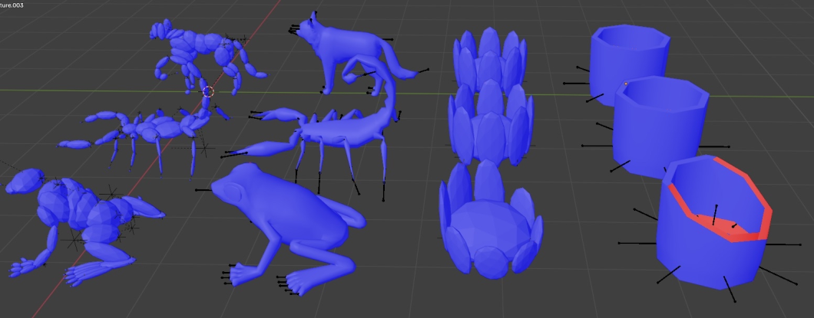
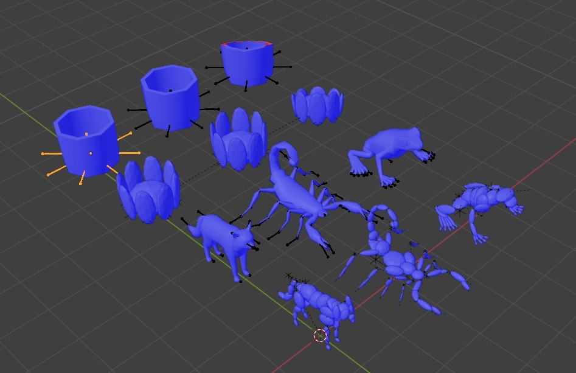
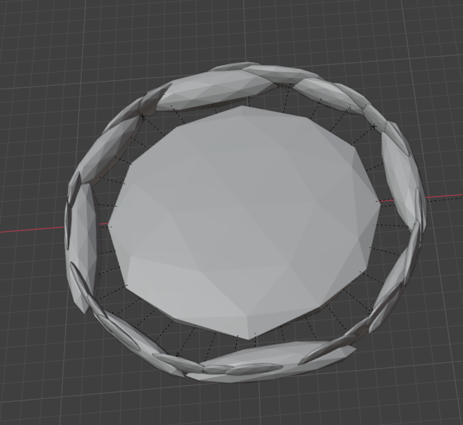
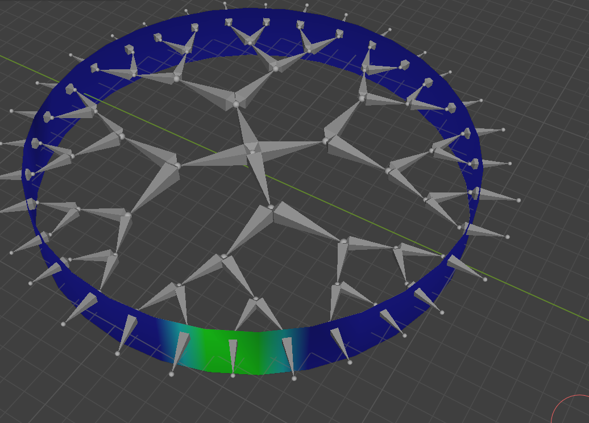
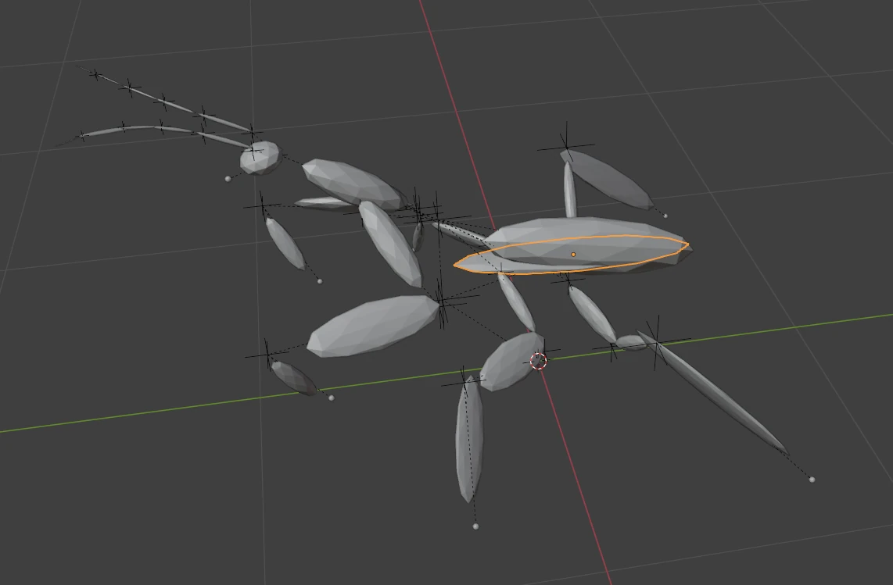

# Rintintin

A zero-dependency C library for computing mass properties and inertia tensors of skinned 3D meshes.

## Overview

Rintintin solves the generalized rigid body problem for skinned meshes, as seen here it computed the masses, centroids and moments of inertia for each bone individually and displayed them as ellipsoids. You can see the animal then the auto-generated rigid-body set for the animal.

  

I’d like to draw your attention to the extreme bucket demo. As you can see i have a bucket such that each bone controls an edge loop. No faces. And then the root bone gets 2 verts one for the top and one for the bottom of the center of the bucket.

And it gets that fine. Then i make it non manifold by deleting those two verts and it can still get the bottom because it can tell from the gestalt that the bottom should be there.

Finally i also apply a Boolean modifier to take a chunk out and it still gets it.

In this demo the “fat bird” concept, is the same idea (ignore its not a bird) but imagine a fat bird (tweet!) where its surrounded by jiggle bones:



I have a ring where each jiggle bone controls one face and the middle has no vertices but it can tell that the middle should have all the mass.

How about a little more?

 

It’s O(tris+bones). I do no mesh modification or segmentation to keep it fast. It can churn though 500k tri meshes in 1 second.

## Licence

This project is licensed under the **GNU General Public License v2.0 (GPL-2.0)**. This means you are free to:
- Use, modify, and distribute the software
- Access the complete source code
- Create derivative works under the same license terms

The GPL-2.0 ensures that any modifications or derivative works must also be made available under the same open source license, preserving the open nature of the project for the community.

For the full license text, see the [LICENSE](LICENSE) file in this repository or visit [gnu.org/licenses/gpl-2.0.html](https://www.gnu.org/licenses/gpl-2.0.html).

### Key Features

- **Zero dependencies** - No stdlib, no malloc, pure C99
- **Thread-safe** - Pure functions with no global state
- **Flexible data access** - Works with any vertex data layout via function pointers
- **Multi-threaded processing** - Integrates with external thread pools
- **Accumulation support** - Handle meshes with >4 bone influences per vertex
- **OpenGL compatibility** - Supports standard vertex attribute formats

## Quick Start

```c
#include "rintintin.h"

// 1. Define vertex data readers for your mesh format
rintintin_error_code read_positions(double* dst, unsigned int index, void const* mesh) {
    MyMesh* m = (MyMesh*)mesh;
    dst[0] = m->positions[index].x;
    dst[1] = m->positions[index].y; 
    dst[2] = m->positions[index].z;
    dst[3] = 0.0; // unused
    return RINTINTIN_SUCCESS;
}

// 2. Set up mesh structure
rintintin_mesh mesh = {
    .position = read_positions,
    .joints = read_joint_indices,
    .weights = read_joint_weights,
    .position_user_data = my_mesh_data,
    // ... configure remaining fields
};

// 3. Get scratch size
unsigned long long scratch_size = rintintin_get_scratch_space_size(num_joints, max_threads);
std::vector<rintintin_metrics> result(num_joints);

// 4. Set up command structure
rintintin_process_command cmd = {
    .mesh = &mesh,
    .skin = {
        .bone_names = 0L, // used for debugging information
        .joint_translation_mesh_space=0L, // optional!!
        .parents=parents, /// Parent joint indices, -1 for root joints (length: no_joints), may only have one root
        .no_joints=num_joints
    },
    .results = result.data(),
    .scratch_space =  malloc(scratch_size),
    .scratch_space_byte_length = scratch_size,
    .max_threads=max_threads,
    .no_meshes=1
};

// 4. Execute (you should check error codes but i don't here.
rintintin_begin(cmd)

MyThreadPool.run(num_threads, [&](int thread_id) {
    rintintin_read_mesh(&cmd, thread_id, num_threads);
    
    int counter = 0;
    do 
    {
        MyThreadPool.sync();
    } while(rintintin_parallel_reduction(&cmd, counter++, thread_id, num_threads));
});

rintintin_end(cmd);

// Results now contain volume, centroid, and inertia for each joint
free(cmd.scratch_space);
return result;
```

## Core Concepts

### Vertex Data Access

Rintintin uses function pointers to read vertex data, making it compatible with any data layout:

```c
typedef rintintin_error_code rintintin_read_attrib_f(double* dst, unsigned int index, void const* layout);
```

- **dst**: Always 4 elements, zero-fill unused components
- **index**: Vertex index to read
- **layout**: Your mesh data structure

This works with:
- Packed arrays (use `rintintin_read_attrib_generic_f`)
- Object-oriented data (Blender Python extensions, etc.)
- Custom formats and compressed data

### Multiple Bone Influences

For meshes with >4 influences per vertex, add more meshes to the array of meshes.
```c
// First pass: bones 0-3
mesh[0].joints = read_joints_0_to_3;
mesh[0].weights = read_weights_0_to_3;

// Second pass: bones 4-7 (accumulates automatically)  
mesh[1].joints = read_joints_4_to_7;
mesh[1].weights = read_weights_4_to_7;
```

## Memory Management

Rintintin performs **no memory allocation**. You provide all buffers:

- **Processing buffer**: Use `calloc()` - must be zero-initialized
- **Tensor buffer**: Use `malloc()` - zero-initialization not required  
- **Scratch space**: Use `malloc()` - temporary working memory

## Error Handling

All functions return `rintintin_error_code`:

```c
rintintin_error_code result = rintintin_mesh_processor(/* ... */);
if (result != RINTINTIN_SUCCESS) {
    // Handle error
    switch (result) {
        case RINTINTIN_ERROR_NULL_POINTER:
            // Required pointer was NULL
            break;
        case RINTINTIN_ERROR_OUT_OF_BOUNDS:
            // Index out of range
            break;
        // ... handle other errors
    }
}
```

## Output Data

For each joint, you get:

```c
typedef struct {
    double volume;                      // Volume influenced by this joint
    rintintin_vec3 centroid;            // Center of mass (mesh space)
    rintintin_symmetric_mat3 inertia;   // Inertia tensor about centroid
} rintintin_metrics;
```

The inertia tensor is stored in compressed symmetric form:
```
| xx  xy  xz |
| xy  yy  yz |  
| xz  yz  zz |
```

## Best Practices

### Mesh Quality
- Use watertight, manifold geometry will get mathematically correct results for tensors. 
- Non-watertight, non-manifold geometry will produce plausible results (usually). 
- Make sure to pass alpha cards, fins and shells, etc, as thin shell objects. 

### Performance
- O(faces * joints_per_face / threads + joints * max_degree_per_joint)
- Use multi-threading for large meshes
- Pre-allocate buffers and reuse them across frames
- Consider level-of-detail for real-time applications

### Integration
- The library integrates cleanly with existing codebases
- No global state means multiple instances can run simultaneously
- Function pointers make it work with any vertex format

## Coordinate Systems

- Input: Mesh space coordinates
- Joint translations: Mesh space
- Output centroids: Mesh space
- Inertia tensors: About the computed centroid

Transform results to your desired coordinate system after computation.

## Limitations

If the bone placement is bad then rintintin will run into difficulties. Hypothetically its possible to fix this--I can get all of those test cases to work while passing nullptr for the bone transforms. However: the heuristics aren't particularly good, and doing this robustly requires solving a quartic with nested radicals--which as far as I can tell is impossible, and newton's method fails because it is too flat. 

For the most part rintintin will produce reasonable results for reasonable assets, that is assets with limited non-manifold issues e.g. eye holes. However if it gets too non-manifold then problems appear, as in here with the mantis, where a double sided face is used for the wings instead of a proper mesh; rintintin can deal with this--if it knows the part of the mesh should be considered a thin shell, but if I don't tell it that...



You can see that the highlighted section is placed weirdly; this is because its's child node is too non-manifold. (when computing the volume with a naive tetrahedra summation the non-manfioldness will effectively double the volume of the mesh)

note: the front claws are messed up because I used auto-skinning and didn't fix the vertex weights. I find rintintin to be useful as a diagnostic tool for bad vertex weights.
